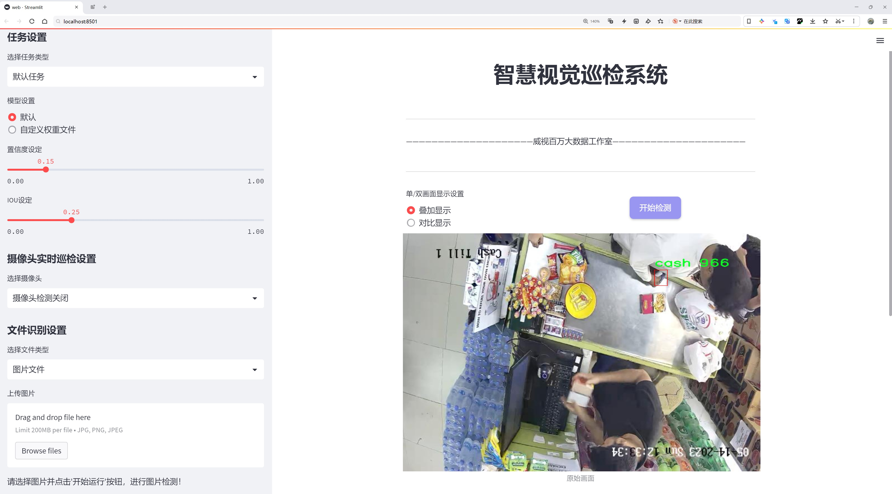
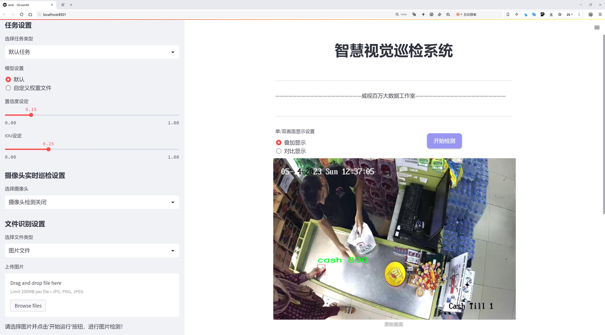
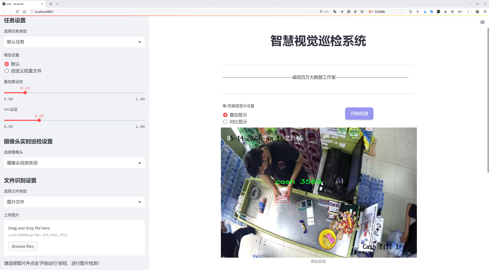
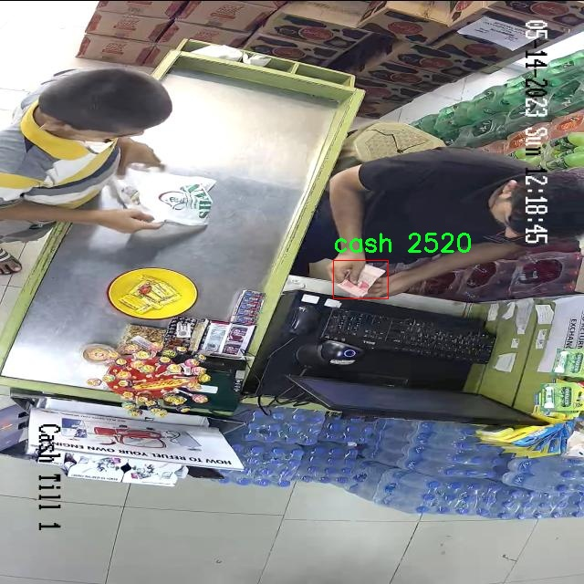
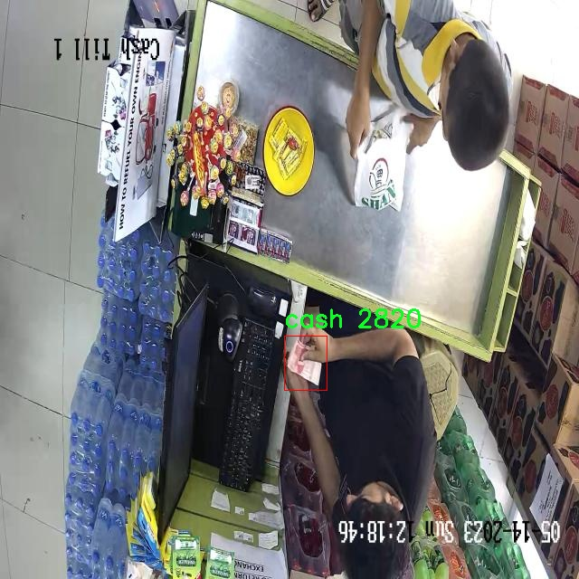
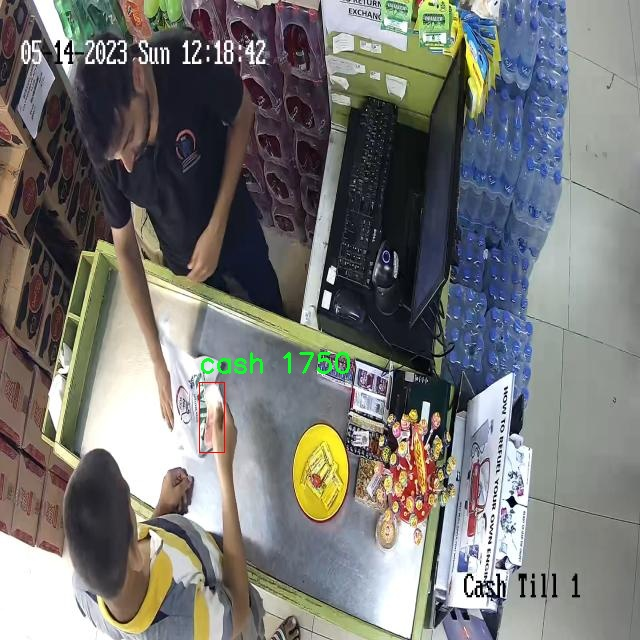

# 现金检测检测系统源码分享
 # [一条龙教学YOLOV8标注好的数据集一键训练_70+全套改进创新点发刊_Web前端展示]

### 1.研究背景与意义

项目参考[AAAI Association for the Advancement of Artificial Intelligence](https://gitee.com/qunshansj/projects)

项目来源[AACV Association for the Advancement of Computer Vision](https://gitee.com/qunmasj/projects)

研究背景与意义

随着经济的快速发展和现金交易的普遍使用，现金的安全管理和监测变得愈发重要。尤其是在金融机构、商超及公共场所，现金的流动性和易携带性使其成为犯罪分子青睐的目标。因此，开发一种高效、准确的现金检测系统，能够实时监测和识别现金的存在，具有重要的现实意义和应用价值。近年来，深度学习技术的迅猛发展为物体检测领域带来了新的机遇，尤其是YOLO（You Only Look Once）系列模型的提出，使得实时物体检测的准确性和速度得到了显著提升。

YOLOv8作为YOLO系列的最新版本，其在目标检测任务中展现出了卓越的性能。通过对YOLOv8的改进，可以进一步提升其在现金检测中的应用效果。现金检测系统的核心在于准确识别和定位现金，传统的检测方法往往依赖于手工特征提取，效率低下且容易受到环境因素的影响。而基于YOLOv8的深度学习模型，能够通过大规模数据训练，自动学习特征，从而实现高效的现金检测。

本研究将基于改进的YOLOv8模型，构建一个专门针对现金检测的系统。该系统将利用1700张图像的训练数据集，专注于现金这一单一类别的检测。尽管数据集的规模相对较小，但通过数据增强技术和迁移学习等方法，可以有效提升模型的泛化能力和检测精度。此外，现金的外观特征相对固定，且在不同场景下的表现具有一定的规律性，这为模型的训练提供了良好的基础。

在实际应用中，现金检测系统不仅可以用于金融机构的安全监控，还可以广泛应用于商超、自动售货机等场景，提升现金管理的安全性和效率。通过实时监测现金的存在与数量，能够有效预防现金盗窃和其他金融犯罪行为，降低经济损失。同时，该系统还可以为现金流动的分析提供数据支持，帮助相关机构优化现金管理策略，提高运营效率。

综上所述，基于改进YOLOv8的现金检测系统的研究，不仅具有重要的理论意义，也具备广泛的应用前景。通过深入探讨该系统的设计与实现，能够为物体检测领域的研究提供新的思路和方法，同时为现金管理的安全性和效率提升贡献力量。这一研究不仅是对现有技术的延续与发展，更是对未来智能监控系统的探索与创新。

### 2.图片演示







##### 注意：由于此博客编辑较早，上面“2.图片演示”和“3.视频演示”展示的系统图片或者视频可能为老版本，新版本在老版本的基础上升级如下：（实际效果以升级的新版本为准）

  （1）适配了YOLOV8的“目标检测”模型和“实例分割”模型，通过加载相应的权重（.pt）文件即可自适应加载模型。

  （2）支持“图片识别”、“视频识别”、“摄像头实时识别”三种识别模式。

  （3）支持“图片识别”、“视频识别”、“摄像头实时识别”三种识别结果保存导出，解决手动导出（容易卡顿出现爆内存）存在的问题，识别完自动保存结果并导出到tempDir中。

  （4）支持Web前端系统中的标题、背景图等自定义修改，后面提供修改教程。

  另外本项目提供训练的数据集和训练教程,暂不提供权重文件（best.pt）,需要您按照教程进行训练后实现图片演示和Web前端界面演示的效果。

### 3.视频演示

[3.1 视频演示](https://www.bilibili.com/video/BV1Fh4te6Ev5/)

### 4.数据集信息展示

##### 4.1 本项目数据集详细数据（类别数＆类别名）

nc: 1
names: ['cash']


##### 4.2 本项目数据集信息介绍

数据集信息展示

在现代计算机视觉领域，现金检测系统的开发日益受到关注，尤其是在金融科技和智能支付等行业的快速发展背景下。为此，我们构建了一个专门用于训练和改进YOLOv8模型的“Cash Detection”数据集。该数据集旨在提升模型在现金识别任务中的准确性和鲁棒性，进而推动相关应用的智能化进程。

“Cash Detection”数据集的设计理念是专注于现金的检测与识别，考虑到现金在实际应用中的多样性和复杂性。该数据集的类别数量为1，专门针对“cash”这一类别进行深入的标注和数据收集。通过这种单一类别的聚焦，我们能够在训练过程中集中精力优化模型的特定性能，确保其在现金检测任务中的表现达到最佳。

在数据集的构建过程中，我们收集了大量的现金图像，涵盖了不同面额、不同角度和不同光照条件下的现金照片。这些图像不仅包括了常见的纸币，还涉及到不同国家和地区的现金样式，以增强模型的泛化能力。通过多样化的样本，我们力求让模型在实际应用中能够适应各种环境和条件，减少因环境变化带来的识别误差。

为了确保数据集的高质量，我们在图像标注过程中采用了严格的标准。每一张图像都经过专业人员的仔细审核和标注，确保现金的边界框精确且一致。这种精细化的标注不仅提升了数据集的可靠性，也为后续的模型训练提供了坚实的基础。此外，我们还对数据集进行了适当的增强处理，包括旋转、缩放和颜色调整等，以进一步丰富数据样本的多样性，从而提高模型的鲁棒性。

在模型训练阶段，我们将“Cash Detection”数据集与YOLOv8模型相结合，利用其强大的特征提取能力和实时检测性能，旨在实现高效的现金识别。YOLOv8作为一种先进的目标检测算法，能够在保持高精度的同时，确保快速的推理速度，适合于实时应用场景。通过不断迭代和优化，我们希望在现金检测的准确性和速度上都能取得显著的提升。

此外，我们还计划在数据集的基础上进行进一步的扩展和更新，以适应不断变化的市场需求和技术进步。随着现金支付方式的演变和新型支付工具的出现，持续更新的数据集将为模型的长期有效性提供保障。我们相信，通过不断的努力和创新，“Cash Detection”数据集将为现金检测系统的研究和应用提供重要的支持，推动金融科技领域的进一步发展。

总之，“Cash Detection”数据集不仅是一个用于训练YOLOv8模型的工具，更是推动现金检测技术进步的重要资源。通过高质量的数据和精确的标注，我们期望能够在现金识别领域取得突破，为相关行业的智能化发展贡献力量。









### 5.全套项目环境部署视频教程（零基础手把手教学）

[5.1 环境部署教程链接（零基础手把手教学）](https://www.ixigua.com/7404473917358506534?logTag=c807d0cbc21c0ef59de5)


[5.2 安装Python虚拟环境创建和依赖库安装视频教程链接（零基础手把手教学）](https://www.ixigua.com/7404474678003106304?logTag=1f1041108cd1f708b01a)

### 6.手把手YOLOV8训练视频教程（零基础小白有手就能学会）

[6.1 手把手YOLOV8训练视频教程（零基础小白有手就能学会）](https://www.ixigua.com/7404477157818401292?logTag=d31a2dfd1983c9668658)

### 7.70+种全套YOLOV8创新点代码加载调参视频教程（一键加载写好的改进模型的配置文件）

[7.1 70+种全套YOLOV8创新点代码加载调参视频教程（一键加载写好的改进模型的配置文件）](https://www.ixigua.com/7404478314661806627?logTag=29066f8288e3f4eea3a4)

### 8.70+种全套YOLOV8创新点原理讲解（非科班也可以轻松写刊发刊，V10版本正在科研待更新）

由于篇幅限制，每个创新点的具体原理讲解就不一一展开，具体见下列网址中的创新点对应子项目的技术原理博客网址【Blog】：


[8.1 70+种全套YOLOV8创新点原理讲解链接](https://gitee.com/qunmasj/good)

### 9.系统功能展示（检测对象为举例，实际内容以本项目数据集为准）

图9.1.系统支持检测结果表格显示

  图9.2.系统支持置信度和IOU阈值手动调节

  图9.3.系统支持自定义加载权重文件best.pt(需要你通过步骤5中训练获得)

  图9.4.系统支持摄像头实时识别

  图9.5.系统支持图片识别

  图9.6.系统支持视频识别

  图9.7.系统支持识别结果文件自动保存

  图9.8.系统支持Excel导出检测结果数据


### 10.原始YOLOV8算法原理

原始YOLOv8算法原理

YOLOv8算法是目标检测领域的一项重要进展，基于YOLOv5和YOLOv7的设计理念，整合了多项创新技术，旨在提升检测精度和速度。其网络结构依然保持了YOLO系列的经典架构，包括输入层、主干网络、特征融合层和解耦头，然而在每个模块中都进行了重要的改进和优化。

在主干网络部分，YOLOv8采用了CSPDarknet的设计思路，并将YOLOv5中的C3模块替换为C2f模块。C2f模块的引入不仅实现了模型的轻量化，还在不牺牲检测精度的前提下，增强了特征提取的能力。C2f模块的设计灵感来源于YOLOv7的ELAN思想，采用了更为丰富的跳层连接，使得梯度流更加顺畅，进而有效缓解了深层网络中的梯度消失问题。C2f模块由多个CBS（卷积+归一化+SiLU激活函数）构成，结合了多条分支的特征流，确保了特征信息的充分利用。

在特征融合层，YOLOv8采用了PAN-FPN（Path Aggregation Network - Feature Pyramid Network）结构，进一步提升了多尺度特征的融合能力。通过对高层特征和中层特征的自下而上的融合，YOLOv8能够更好地捕捉到不同尺度下的目标信息。特征融合的过程通过删除上采样阶段的卷积层，使得高层特征能够直接与中层特征进行连接，从而保留了更多的细节信息。这种设计不仅提高了特征融合的效率，还确保了在不同层次上都能有效地进行目标检测。

YOLOv8在目标检测的核心思想上进行了重要的创新，摒弃了传统的Anchor-Base方法，转而采用Anchor-Free的策略。这一转变使得模型在处理目标时更加灵活，能够直接预测目标的中心位置，并通过Task-Aligned的匹配策略来优化样本的匹配过程。这种新的匹配方式，结合了分类分数和IOU的高次幂乘积，确保了模型在分类和定位任务上的高效性和准确性。

在损失函数的设计上，YOLOv8引入了VFLLoss作为分类损失，并结合DFLLoss和CIoULoss来优化边框回归。这种多损失函数的组合，旨在提升模型对难以分类样本的敏感性，特别是在处理样本不平衡的情况下，能够有效提高检测精度。Focal Loss的引入，进一步增强了模型对小目标和困难样本的学习能力，确保了在实际应用中，YOLOv8能够在复杂场景下依然保持高效的检测性能。

YOLOv8的头部结构借鉴了YOLOX和YOLOv6的解耦头设计，采用了二阶段的FCOS目标检测网络。通过将分类和回归任务分开处理，YOLOv8能够在不同的分支中专注于各自的任务特性，从而提高了收敛速度和预测精度。解耦头的设计使得模型在进行目标分类时，能够更好地分析特征图中的信息，而在边框回归时，则更关注边界框与真实框之间的关系。这种结构的优化，结合了YOLOv8的无锚框特性，使得模型在目标检测的各个方面都达到了新的高度。

数据预处理方面，YOLOv8在训练过程中采用了多种增强手段，包括马赛克增强、混合增强、空间扰动和颜色扰动等，以提高模型的鲁棒性和泛化能力。然而，在训练的最后阶段，YOLOv8停止使用马赛克增强，以避免对数据真实分布的干扰。这一策略的调整，确保了模型在学习过程中能够更好地捕捉到目标的真实特征。

综上所述，YOLOv8算法通过对网络结构的优化、特征融合的增强、损失函数的创新以及数据预处理策略的调整，成功地提升了目标检测的性能。其在精度和速度上的双重优势，使得YOLOv8在实际应用中展现出广泛的潜力，尤其是在实时目标检测任务中，能够有效满足对速度和准确性的高要求。随着YOLOv8的推出，目标检测领域迎来了新的发展机遇，为后续的研究和应用提供了坚实的基础。


### 11.项目核心源码讲解（再也不用担心看不懂代码逻辑）

#### 11.1 70+种YOLOv8算法改进源码大全和调试加载训练教程（非必要）\ultralytics\models\yolo\segment\__init__.py

以下是对给定代码的核心部分进行提炼和详细注释的结果：

```python
# Ultralytics YOLO 🚀, AGPL-3.0 license

# 从当前模块导入三个类：SegmentationPredictor、SegmentationTrainer 和 SegmentationValidator
from .predict import SegmentationPredictor  # 导入用于图像分割预测的类
from .train import SegmentationTrainer      # 导入用于训练图像分割模型的类
from .val import SegmentationValidator       # 导入用于验证图像分割模型性能的类

# 定义模块的公开接口，确保外部可以访问这三个类
__all__ = 'SegmentationPredictor', 'SegmentationTrainer', 'SegmentationValidator'
```

### 代码分析与注释：

1. **模块导入**：
   - `from .predict import SegmentationPredictor`：这行代码从当前包的 `predict` 模块中导入 `SegmentationPredictor` 类，该类负责处理图像分割的预测任务。
   - `from .train import SegmentationTrainer`：这行代码从当前包的 `train` 模块中导入 `SegmentationTrainer` 类，该类用于训练图像分割模型。
   - `from .val import SegmentationValidator`：这行代码从当前包的 `val` 模块中导入 `SegmentationValidator` 类，该类用于验证训练好的模型的性能。

2. **公开接口**：
   - `__all__` 是一个特殊变量，用于定义当使用 `from module import *` 语句时，哪些名称是可以被导入的。在这里，定义了三个类 `SegmentationPredictor`、`SegmentationTrainer` 和 `SegmentationValidator`，表示这些类是模块的核心功能部分，外部用户可以直接使用它们。

通过这样的结构，代码实现了模块化设计，使得图像分割相关的功能可以被清晰地组织和调用。

这个文件是Ultralytics YOLO项目中的一个初始化文件，通常命名为`__init__.py`，用于将该目录标识为一个Python包。文件中首先包含了一条版权声明，表明该项目遵循AGPL-3.0许可证。

接下来，文件导入了三个模块：`SegmentationPredictor`、`SegmentationTrainer`和`SegmentationValidator`。这些模块分别负责不同的功能，具体来说，`SegmentationPredictor`用于图像分割的预测，`SegmentationTrainer`用于训练分割模型，而`SegmentationValidator`则用于验证模型的性能。

最后，`__all__`变量定义了当使用`from module import *`语句时，哪些名称会被导入。这里列出了三个类，确保它们可以被外部模块访问。

总的来说，这个文件的主要作用是组织和暴露与YOLOv8图像分割相关的功能模块，使得其他部分的代码能够方便地使用这些功能。

#### 11.2 ui.py

```python
import sys
import subprocess

def run_script(script_path):
    """
    使用当前 Python 环境运行指定的脚本。

    Args:
        script_path (str): 要运行的脚本路径

    Returns:
        None
    """
    # 获取当前 Python 解释器的路径
    python_path = sys.executable

    # 构建运行命令
    command = f'"{python_path}" -m streamlit run "{script_path}"'

    # 执行命令
    result = subprocess.run(command, shell=True)
    if result.returncode != 0:
        print("脚本运行出错。")


# 实例化并运行应用
if __name__ == "__main__":
    # 指定您的脚本路径
    script_path = "web.py"  # 这里直接指定脚本路径

    # 运行脚本
    run_script(script_path)
```

### 代码核心部分及注释

1. **导入模块**：
   ```python
   import sys
   import subprocess
   ```
   - `sys` 模块用于访问与 Python 解释器紧密相关的变量和函数。
   - `subprocess` 模块允许我们生成新的进程，连接到它们的输入/输出/错误管道，并获得它们的返回码。

2. **定义 `run_script` 函数**：
   ```python
   def run_script(script_path):
   ```
   - 该函数接收一个参数 `script_path`，表示要运行的 Python 脚本的路径。

3. **获取当前 Python 解释器的路径**：
   ```python
   python_path = sys.executable
   ```
   - `sys.executable` 返回当前 Python 解释器的路径，确保我们使用的是正确的 Python 环境来运行脚本。

4. **构建运行命令**：
   ```python
   command = f'"{python_path}" -m streamlit run "{script_path}"'
   ```
   - 使用 f-string 格式化字符串，构建一个命令行命令，用于运行指定的脚本。这里使用了 `streamlit` 模块来运行脚本。

5. **执行命令**：
   ```python
   result = subprocess.run(command, shell=True)
   ```
   - `subprocess.run` 方法执行构建的命令。`shell=True` 允许我们在 shell 中执行命令。

6. **检查命令执行结果**：
   ```python
   if result.returncode != 0:
       print("脚本运行出错。")
   ```
   - 检查命令的返回码，如果不为 0，表示脚本运行出错，打印错误信息。

7. **主程序入口**：
   ```python
   if __name__ == "__main__":
   ```
   - 这部分代码确保只有在直接运行该脚本时才会执行以下代码，而不是被导入为模块时。

8. **指定脚本路径并运行**：
   ```python
   script_path = "web.py"  # 这里直接指定脚本路径
   run_script(script_path)
   ```
   - 指定要运行的脚本路径，并调用 `run_script` 函数来执行该脚本。

这个程序文件的主要功能是通过当前的 Python 环境来运行一个指定的脚本，具体是一个名为 `web.py` 的文件。首先，程序导入了必要的模块，包括 `sys`、`os` 和 `subprocess`，这些模块提供了与系统交互和执行外部命令的功能。此外，还导入了 `abs_path` 函数，这个函数来自于 `QtFusion.path` 模块，用于获取文件的绝对路径。

在 `run_script` 函数中，首先获取当前 Python 解释器的路径，存储在 `python_path` 变量中。接着，构建一个命令字符串，该命令使用 `streamlit` 来运行指定的脚本。这里的命令格式为 `"{python_path}" -m streamlit run "{script_path}"`，其中 `script_path` 是要运行的脚本的路径。

然后，使用 `subprocess.run` 方法执行这个命令，`shell=True` 参数表示在 shell 中执行命令。执行后，程序检查返回码 `result.returncode`，如果不等于 0，说明脚本运行过程中出现了错误，程序会打印出“脚本运行出错。”的提示信息。

在文件的最后部分，使用 `if __name__ == "__main__":` 来判断当前模块是否是主程序。如果是，程序会调用 `abs_path` 函数来获取 `web.py` 的绝对路径，并将其传递给 `run_script` 函数，从而启动该脚本的运行。

总体来说，这个程序的设计是为了方便地在 Python 环境中运行一个 Streamlit 应用脚本，并能够处理可能出现的错误。

#### 11.3 code\ultralytics\data\split_dota.py

以下是代码中最核心的部分，并附上详细的中文注释：

```python
import itertools
from glob import glob
from math import ceil
from pathlib import Path
import cv2
import numpy as np
from PIL import Image
from tqdm import tqdm
from ultralytics.data.utils import exif_size, img2label_paths

def load_yolo_dota(data_root, split="train"):
    """
    加载DOTA数据集。

    参数:
        data_root (str): 数据根目录。
        split (str): 数据集的划分，可以是'train'或'val'。

    注意:
        DOTA数据集的目录结构假设如下：
            - data_root
                - images
                    - train
                    - val
                - labels
                    - train
                    - val
    """
    assert split in ["train", "val"]
    im_dir = Path(data_root) / "images" / split
    assert im_dir.exists(), f"找不到 {im_dir}，请检查数据根目录。"
    im_files = glob(str(Path(data_root) / "images" / split / "*"))
    lb_files = img2label_paths(im_files)
    annos = []
    for im_file, lb_file in zip(im_files, lb_files):
        w, h = exif_size(Image.open(im_file))  # 获取图像的原始宽高
        with open(lb_file) as f:
            lb = [x.split() for x in f.read().strip().splitlines() if len(x)]
            lb = np.array(lb, dtype=np.float32)  # 转换标签为浮点型数组
        annos.append(dict(ori_size=(h, w), label=lb, filepath=im_file))  # 保存原始尺寸、标签和文件路径
    return annos

def get_windows(im_size, crop_sizes=[1024], gaps=[200], im_rate_thr=0.6, eps=0.01):
    """
    获取窗口的坐标。

    参数:
        im_size (tuple): 原始图像大小，(h, w)。
        crop_sizes (List(int)): 窗口的裁剪大小。
        gaps (List(int)): 窗口之间的间隔。
        im_rate_thr (float): 窗口面积与图像面积的阈值。
    """
    h, w = im_size
    windows = []
    for crop_size, gap in zip(crop_sizes, gaps):
        assert crop_size > gap, f"无效的裁剪大小和间隔对 [{crop_size} {gap}]"
        step = crop_size - gap

        xn = 1 if w <= crop_size else ceil((w - crop_size) / step + 1)  # 计算在宽度方向上可以放置的窗口数量
        xs = [step * i for i in range(xn)]
        if len(xs) > 1 and xs[-1] + crop_size > w:
            xs[-1] = w - crop_size  # 确保最后一个窗口不超出边界

        yn = 1 if h <= crop_size else ceil((h - crop_size) / step + 1)  # 计算在高度方向上可以放置的窗口数量
        ys = [step * i for i in range(yn)]
        if len(ys) > 1 and ys[-1] + crop_size > h:
            ys[-1] = h - crop_size  # 确保最后一个窗口不超出边界

        start = np.array(list(itertools.product(xs, ys)), dtype=np.int64)  # 窗口的起始坐标
        stop = start + crop_size  # 窗口的结束坐标
        windows.append(np.concatenate([start, stop], axis=1))  # 合并起始和结束坐标
    windows = np.concatenate(windows, axis=0)  # 合并所有窗口

    # 计算窗口内的图像区域和窗口面积
    im_in_wins = windows.copy()
    im_in_wins[:, 0::2] = np.clip(im_in_wins[:, 0::2], 0, w)
    im_in_wins[:, 1::2] = np.clip(im_in_wins[:, 1::2], 0, h)
    im_areas = (im_in_wins[:, 2] - im_in_wins[:, 0]) * (im_in_wins[:, 3] - im_in_wins[:, 1])
    win_areas = (windows[:, 2] - windows[:, 0]) * (windows[:, 3] - windows[:, 1])
    im_rates = im_areas / win_areas  # 计算图像区域与窗口区域的比率
    if not (im_rates > im_rate_thr).any():
        max_rate = im_rates.max()
        im_rates[abs(im_rates - max_rate) < eps] = 1  # 如果没有窗口符合阈值，设置最大比率为1
    return windows[im_rates > im_rate_thr]  # 返回符合阈值的窗口

def crop_and_save(anno, windows, window_objs, im_dir, lb_dir):
    """
    裁剪图像并保存新的标签。

    参数:
        anno (dict): 注释字典，包括 `filepath`、`label`、`ori_size` 作为其键。
        windows (list): 窗口坐标列表。
        window_objs (list): 每个窗口内的标签列表。
        im_dir (str): 图像输出目录路径。
        lb_dir (str): 标签输出目录路径。
    """
    im = cv2.imread(anno["filepath"])  # 读取原始图像
    name = Path(anno["filepath"]).stem  # 获取文件名（不带扩展名）
    for i, window in enumerate(windows):
        x_start, y_start, x_stop, y_stop = window.tolist()  # 获取窗口的起始和结束坐标
        new_name = f"{name}__{x_stop - x_start}__{x_start}___{y_start}"  # 新文件名
        patch_im = im[y_start:y_stop, x_start:x_stop]  # 裁剪图像
        ph, pw = patch_im.shape[:2]  # 获取裁剪后图像的高度和宽度

        cv2.imwrite(str(Path(im_dir) / f"{new_name}.jpg"), patch_im)  # 保存裁剪后的图像
        label = window_objs[i]  # 获取当前窗口的标签
        if len(label) == 0:
            continue  # 如果没有标签，跳过

        # 归一化标签坐标
        label[:, 1::2] -= x_start
        label[:, 2::2] -= y_start
        label[:, 1::2] /= pw
        label[:, 2::2] /= ph

        # 保存标签到文件
        with open(Path(lb_dir) / f"{new_name}.txt", "w") as f:
            for lb in label:
                formatted_coords = ["{:.6g}".format(coord) for coord in lb[1:]]
                f.write(f"{int(lb[0])} {' '.join(formatted_coords)}\n")

def split_images_and_labels(data_root, save_dir, split="train", crop_sizes=[1024], gaps=[200]):
    """
    分割图像和标签。

    注意:
        DOTA数据集的目录结构假设如下：
            - data_root
                - images
                    - split
                - labels
                    - split
        输出目录结构为：
            - save_dir
                - images
                    - split
                - labels
                    - split
    """
    im_dir = Path(save_dir) / "images" / split
    im_dir.mkdir(parents=True, exist_ok=True)  # 创建图像输出目录
    lb_dir = Path(save_dir) / "labels" / split
    lb_dir.mkdir(parents=True, exist_ok=True)  # 创建标签输出目录

    annos = load_yolo_dota(data_root, split=split)  # 加载注释
    for anno in tqdm(annos, total=len(annos), desc=split):
        windows = get_windows(anno["ori_size"], crop_sizes, gaps)  # 获取窗口
        window_objs = get_window_obj(anno, windows)  # 获取每个窗口内的对象
        crop_and_save(anno, windows, window_objs, str(im_dir), str(lb_dir))  # 裁剪并保存

if __name__ == "__main__":
    split_trainval(data_root="DOTAv2", save_dir="DOTAv2-split")  # 分割训练和验证集
    split_test(data_root="DOTAv2", save_dir="DOTAv2-split")  # 分割测试集
```

### 代码核心部分概述：
1. **加载数据集**：`load_yolo_dota` 函数负责加载DOTA数据集的图像和标签。
2. **窗口生成**：`get_windows` 函数根据给定的图像大小和裁剪参数生成窗口坐标。
3. **裁剪与保存**：`crop_and_save` 函数根据窗口坐标裁剪图像并保存相应的标签。
4. **主函数**：`split_images_and_labels` 函数将图像和标签分割成小块，并保存到指定目录。

这些函数共同工作，实现了从原始数据集中加载数据、生成窗口、裁剪图像以及保存裁剪后的图像和标签的完整流程。

这个程序文件主要用于处理DOTA（Dataset for Object Detection in Aerial Images）数据集的图像和标签的分割。程序的核心功能是将大图像切割成多个小图像，并相应地调整和保存其标签。以下是对程序各部分的详细说明。

首先，程序导入了一些必要的库，包括用于图像处理的OpenCV和PIL，数组处理的NumPy，以及用于几何计算的Shapely库。程序还定义了一些辅助函数来处理边界框和多边形的交集、加载数据集、获取窗口坐标等。

`bbox_iof`函数计算两个边界框之间的交集比（Intersection over Union, IoU），用于评估重叠区域的大小。该函数接收多边形和边界框的坐标，计算它们的交集面积和并集面积，从而得到IoU值。

`load_yolo_dota`函数用于加载DOTA数据集的图像和标签。它根据指定的分割（训练集或验证集）读取图像和相应的标签文件，并将其存储在一个字典列表中，包含原始图像大小、标签和文件路径。

`get_windows`函数根据原始图像的大小和指定的裁剪尺寸及间隔，计算出多个窗口的坐标。这些窗口将用于后续的图像裁剪。

`get_window_obj`函数根据给定的窗口和标签，提取每个窗口内的对象信息。它会计算每个窗口与标签的IoU，并返回符合阈值的标签。

`crop_and_save`函数负责根据窗口坐标裁剪图像，并保存裁剪后的图像和更新后的标签。裁剪后的标签会根据窗口的位置进行调整，以确保它们与新图像的坐标系统一致。

`split_images_and_labels`函数是主函数之一，它会遍历所有的注释数据，计算窗口，提取对象信息，并调用裁剪和保存函数来处理每个图像。

`split_trainval`和`split_test`函数分别用于处理训练集和验证集的分割，以及测试集的分割。它们会根据给定的裁剪尺寸和间隔调用`split_images_and_labels`函数。

最后，程序的入口部分会调用`split_trainval`和`split_test`函数，指定数据根目录和保存目录，执行数据集的分割操作。

总体来说，这个程序的目的是为了将DOTA数据集中的大图像分割成小图像，并生成相应的标签文件，以便于后续的模型训练和评估。通过合理的窗口划分和标签调整，程序能够有效地处理大规模的图像数据集。

#### 11.4 code\ultralytics\models\sam\modules\sam.py

以下是代码中最核心的部分，并附上详细的中文注释：

```python
from typing import List
import torch
from torch import nn
from .decoders import MaskDecoder
from .encoders import ImageEncoderViT, PromptEncoder

class Sam(nn.Module):
    """
    Sam（Segment Anything Model）旨在处理物体分割任务。它使用图像编码器生成图像嵌入，并使用提示编码器对各种类型的输入提示进行编码。这些嵌入随后被掩码解码器用于预测物体掩码。
    
    属性：
        mask_threshold (float): 掩码预测的阈值。
        image_format (str): 输入图像的格式，默认为 'RGB'。
        image_encoder (ImageEncoderViT): 用于将图像编码为嵌入的主干网络。
        prompt_encoder (PromptEncoder): 编码各种类型的输入提示。
        mask_decoder (MaskDecoder): 根据图像和提示嵌入预测物体掩码。
        pixel_mean (List[float]): 用于图像归一化的均值像素值。
        pixel_std (List[float]): 用于图像归一化的标准差值。
    """

    mask_threshold: float = 0.0  # 掩码预测的阈值，初始值为0.0
    image_format: str = "RGB"     # 输入图像的格式，默认为RGB

    def __init__(
        self,
        image_encoder: ImageEncoderViT,  # 图像编码器，用于将图像转换为嵌入
        prompt_encoder: PromptEncoder,    # 提示编码器，用于编码输入提示
        mask_decoder: MaskDecoder,        # 掩码解码器，用于从嵌入中预测掩码
        pixel_mean: List[float] = (123.675, 116.28, 103.53),  # 图像归一化的均值
        pixel_std: List[float] = (58.395, 57.12, 57.375),      # 图像归一化的标准差
    ) -> None:
        """
        初始化 Sam 类，用于从图像和输入提示中预测物体掩码。

        注意：
            所有的 forward() 操作已移至 SAMPredictor。

        参数：
            image_encoder (ImageEncoderViT): 用于将图像编码为图像嵌入的主干网络。
            prompt_encoder (PromptEncoder): 编码各种类型的输入提示。
            mask_decoder (MaskDecoder): 从图像嵌入和编码的提示中预测掩码。
            pixel_mean (List[float], optional): 输入图像的像素归一化均值，默认为 (123.675, 116.28, 103.53)。
            pixel_std (List[float], optional): 输入图像的像素归一化标准差，默认为 (58.395, 57.12, 57.375)。
        """
        super().__init__()  # 调用父类 nn.Module 的初始化方法
        self.image_encoder = image_encoder  # 设置图像编码器
        self.prompt_encoder = prompt_encoder  # 设置提示编码器
        self.mask_decoder = mask_decoder  # 设置掩码解码器
        # 注册均值和标准差作为缓冲区，用于图像归一化
        self.register_buffer("pixel_mean", torch.Tensor(pixel_mean).view(-1, 1, 1), False)
        self.register_buffer("pixel_std", torch.Tensor(pixel_std).view(-1, 1, 1), False)
```

### 代码核心部分解释：
1. **类定义**：`Sam` 类继承自 `nn.Module`，用于实现物体分割模型。
2. **属性**：定义了模型的主要属性，包括掩码阈值、图像格式、编码器和解码器等。
3. **初始化方法**：构造函数接收图像编码器、提示编码器和掩码解码器，并初始化它们。同时注册了用于图像归一化的均值和标准差。

这个程序文件定义了一个名为 `Sam` 的类，属于 Ultralytics YOLO 项目的一部分，主要用于对象分割任务。该类继承自 PyTorch 的 `nn.Module`，是构建深度学习模型的基础类。

在 `Sam` 类的文档字符串中，简要介绍了其功能和主要组件。该模型的设计目的是处理图像分割，使用图像编码器生成图像嵌入，并通过提示编码器对各种输入提示进行编码。随后，这些嵌入会被掩码解码器用来预测对象的掩码。

类中定义了几个重要的属性，包括：
- `mask_threshold`：用于掩码预测的阈值。
- `image_format`：输入图像的格式，默认为 'RGB'。
- `image_encoder`：使用的图像编码器，具体实现为 `ImageEncoderViT`。
- `prompt_encoder`：用于编码各种类型输入提示的编码器。
- `mask_decoder`：从图像和提示嵌入中预测对象掩码的解码器。
- `pixel_mean` 和 `pixel_std`：用于图像归一化的均值和标准差。

在 `__init__` 方法中，类的构造函数接受多个参数，包括图像编码器、提示编码器和掩码解码器，以及可选的像素均值和标准差。构造函数首先调用父类的初始化方法，然后将传入的编码器和解码器赋值给相应的属性。接着，使用 `register_buffer` 方法注册了像素均值和标准差，这样它们就会被视为模型的一部分，但不会被视为模型的可学习参数。

总的来说，这个类是一个对象分割模型的核心组件，负责处理图像和提示输入，并准备好进行掩码预测。

#### 11.5 train.py

以下是代码中最核心的部分，并附上详细的中文注释：

```python
class DetectionTrainer(BaseTrainer):
    """
    扩展自 BaseTrainer 类的检测模型训练类。
    用于训练 YOLO 检测模型。
    """

    def build_dataset(self, img_path, mode="train", batch=None):
        """
        构建 YOLO 数据集。

        参数:
            img_path (str): 包含图像的文件夹路径。
            mode (str): 模式，`train` 表示训练模式，`val` 表示验证模式。
            batch (int, optional): 批次大小，仅用于 `rect` 模式。默认为 None。
        """
        gs = max(int(de_parallel(self.model).stride.max() if self.model else 0), 32)
        return build_yolo_dataset(self.args, img_path, batch, self.data, mode=mode, rect=mode == "val", stride=gs)

    def get_dataloader(self, dataset_path, batch_size=16, rank=0, mode="train"):
        """构造并返回数据加载器。"""
        assert mode in ["train", "val"]  # 确保模式有效
        with torch_distributed_zero_first(rank):  # 在分布式训练中，确保数据集只初始化一次
            dataset = self.build_dataset(dataset_path, mode, batch_size)  # 构建数据集
        shuffle = mode == "train"  # 训练模式下打乱数据
        if getattr(dataset, "rect", False) and shuffle:
            LOGGER.warning("WARNING ⚠️ 'rect=True' 与 DataLoader shuffle 不兼容，设置 shuffle=False")
            shuffle = False
        workers = self.args.workers if mode == "train" else self.args.workers * 2  # 设置工作线程数
        return build_dataloader(dataset, batch_size, workers, shuffle, rank)  # 返回数据加载器

    def preprocess_batch(self, batch):
        """对一批图像进行预处理，包括缩放和转换为浮点数。"""
        batch["img"] = batch["img"].to(self.device, non_blocking=True).float() / 255  # 转换为浮点数并归一化
        if self.args.multi_scale:  # 如果启用多尺度
            imgs = batch["img"]
            sz = (
                random.randrange(self.args.imgsz * 0.5, self.args.imgsz * 1.5 + self.stride)
                // self.stride
                * self.stride
            )  # 随机选择新的尺寸
            sf = sz / max(imgs.shape[2:])  # 计算缩放因子
            if sf != 1:
                ns = [
                    math.ceil(x * sf / self.stride) * self.stride for x in imgs.shape[2:]
                ]  # 计算新的形状
                imgs = nn.functional.interpolate(imgs, size=ns, mode="bilinear", align_corners=False)  # 进行插值缩放
            batch["img"] = imgs  # 更新批次图像
        return batch

    def get_model(self, cfg=None, weights=None, verbose=True):
        """返回 YOLO 检测模型。"""
        model = DetectionModel(cfg, nc=self.data["nc"], verbose=verbose and RANK == -1)  # 创建检测模型
        if weights:
            model.load(weights)  # 加载权重
        return model

    def get_validator(self):
        """返回用于 YOLO 模型验证的 DetectionValidator。"""
        self.loss_names = "box_loss", "cls_loss", "dfl_loss"  # 定义损失名称
        return yolo.detect.DetectionValidator(
            self.test_loader, save_dir=self.save_dir, args=copy(self.args), _callbacks=self.callbacks
        )  # 返回验证器

    def plot_training_samples(self, batch, ni):
        """绘制带有注释的训练样本。"""
        plot_images(
            images=batch["img"],
            batch_idx=batch["batch_idx"],
            cls=batch["cls"].squeeze(-1),
            bboxes=batch["bboxes"],
            paths=batch["im_file"],
            fname=self.save_dir / f"train_batch{ni}.jpg",
            on_plot=self.on_plot,
        )  # 绘制图像

    def plot_metrics(self):
        """从 CSV 文件中绘制指标。"""
        plot_results(file=self.csv, on_plot=self.on_plot)  # 保存结果图
```

### 代码核心部分说明：
1. **DetectionTrainer 类**：继承自 `BaseTrainer`，用于训练 YOLO 检测模型。
2. **build_dataset 方法**：根据输入路径和模式构建数据集，支持训练和验证模式。
3. **get_dataloader 方法**：构建数据加载器，支持多线程和数据打乱。
4. **preprocess_batch 方法**：对输入的图像批次进行预处理，包括归一化和多尺度调整。
5. **get_model 方法**：返回一个 YOLO 检测模型，并可选择性地加载预训练权重。
6. **get_validator 方法**：返回用于模型验证的验证器。
7. **plot_training_samples 和 plot_metrics 方法**：用于可视化训练样本和训练指标。

这个程序文件 `train.py` 是一个用于训练 YOLO（You Only Look Once）目标检测模型的实现，继承自 `BaseTrainer` 类。文件中主要包含了数据集构建、数据加载、模型预处理、模型属性设置、模型获取、验证器获取、损失项处理、训练进度显示、训练样本绘制以及绘制训练指标等功能。

首先，程序导入了必要的库和模块，包括数学运算、随机数生成、深度学习相关的库以及 YOLO 模型和数据处理的工具。接着，定义了 `DetectionTrainer` 类，这个类主要负责训练过程中的各项操作。

在 `build_dataset` 方法中，程序根据给定的图像路径和模式（训练或验证）构建 YOLO 数据集。该方法还支持批量大小的设置，并根据模型的步幅（stride）进行相应的调整。

`get_dataloader` 方法用于构建和返回数据加载器。它会根据训练或验证模式选择是否打乱数据，并根据设置的工作线程数来创建数据加载器。

`preprocess_batch` 方法对每个批次的图像进行预处理，包括将图像缩放到适当的大小并转换为浮点数格式。该方法还支持多尺度训练，即在训练过程中随机选择图像的大小。

`set_model_attributes` 方法用于设置模型的属性，包括类别数量和类别名称等。这些属性会影响模型的训练和推理过程。

`get_model` 方法返回一个 YOLO 检测模型实例，并支持加载预训练权重。

`get_validator` 方法返回一个用于验证模型性能的验证器实例，主要用于在训练后评估模型的表现。

`label_loss_items` 方法用于返回带有标签的训练损失项字典，方便后续的损失监控和分析。

`progress_string` 方法返回一个格式化的字符串，显示训练进度，包括当前的 epoch、GPU 内存使用情况、损失值、实例数量和图像大小等信息。

`plot_training_samples` 方法用于绘制训练样本及其标注，便于可视化训练数据的质量。

最后，`plot_metrics` 和 `plot_training_labels` 方法分别用于绘制训练过程中的指标和创建带标签的训练图，以便于分析模型的训练效果。

总体来说，这个文件提供了一个完整的训练框架，涵盖了从数据准备到模型训练、验证和结果可视化的各个方面，适用于使用 YOLO 模型进行目标检测任务的开发者。

#### 11.6 70+种YOLOv8算法改进源码大全和调试加载训练教程（非必要）\ultralytics\utils\files.py

以下是经过简化和注释的核心代码部分：

```python
import os
from pathlib import Path
from datetime import datetime

def increment_path(path, exist_ok=False, sep='', mkdir=False):
    """
    增加文件或目录路径的版本号，例如将 'runs/exp' 增加为 'runs/exp_2', 'runs/exp_3' 等。

    参数:
        path (str, pathlib.Path): 要增加的路径。
        exist_ok (bool, optional): 如果为 True，则返回原路径，不进行增加。默认为 False。
        sep (str, optional): 路径与版本号之间的分隔符。默认为 ''。
        mkdir (bool, optional): 如果路径不存在，则创建该目录。默认为 False。

    返回:
        (pathlib.Path): 增加后的路径。
    """
    path = Path(path)  # 将路径转换为 Path 对象
    if path.exists() and not exist_ok:
        # 如果路径存在且不允许重复，则进行版本号增加
        path, suffix = (path.with_suffix(''), path.suffix) if path.is_file() else (path, '')

        # 尝试增加版本号
        for n in range(2, 9999):
            p = f'{path}{sep}{n}{suffix}'  # 生成新的路径
            if not os.path.exists(p):  # 如果新路径不存在，则使用该路径
                break
        path = Path(p)  # 更新路径为新路径

    if mkdir:
        path.mkdir(parents=True, exist_ok=True)  # 如果需要，创建目录

    return path  # 返回增加后的路径


def file_age(path):
    """返回文件自上次更新以来的天数。"""
    dt = (datetime.now() - datetime.fromtimestamp(Path(path).stat().st_mtime))  # 计算时间差
    return dt.days  # 返回天数


def file_size(path):
    """返回文件或目录的大小（MB）。"""
    if isinstance(path, (str, Path)):
        mb = 1 << 20  # 将字节转换为MB（1024 ** 2）
        path = Path(path)
        if path.is_file():
            return path.stat().st_size / mb  # 返回文件大小
        elif path.is_dir():
            # 返回目录下所有文件的总大小
            return sum(f.stat().st_size for f in path.glob('**/*') if f.is_file()) / mb
    return 0.0  # 如果路径无效，返回0.0
```

### 代码说明：
1. **increment_path**: 该函数用于增加文件或目录的版本号。如果指定的路径已经存在，函数会在路径后添加一个数字后缀，确保路径唯一。可以选择是否创建该路径。

2. **file_age**: 该函数计算并返回文件自上次修改以来的天数，利用文件的最后修改时间戳进行计算。

3. **file_size**: 该函数返回指定文件或目录的大小，单位为MB。如果是文件，直接返回文件大小；如果是目录，则计算目录下所有文件的总大小。

这个程序文件是Ultralytics YOLO项目的一部分，主要用于处理文件和目录的操作。文件中定义了一些实用的工具函数和上下文管理器，帮助用户在使用YOLO算法时更方便地管理工作目录和文件。

首先，`WorkingDirectory`类是一个上下文管理器，允许用户在指定的目录中执行代码。当用户进入这个上下文时，当前工作目录会被更改为指定的目录；当退出上下文时，工作目录会恢复到原来的位置。这对于需要在特定目录下运行程序的情况非常有用。

接下来，`spaces_in_path`是另一个上下文管理器，用于处理路径中包含空格的情况。如果路径中有空格，它会将空格替换为下划线，并将文件或目录复制到一个临时路径中。在执行上下文代码块后，它会将文件或目录复制回原来的位置。这可以避免在处理文件时由于路径中空格导致的问题。

`increment_path`函数用于递增文件或目录的路径。如果指定的路径已经存在，函数会在路径后附加一个数字，以创建一个新的唯一路径。这个函数支持文件和目录，并且可以选择在路径不存在时自动创建目录。

`file_age`和`file_date`函数分别用于获取文件的最后修改时间，返回自上次更新以来的天数和可读的修改日期。这对于文件管理和版本控制非常有用。

`file_size`函数则用于计算文件或目录的大小，返回以MB为单位的大小。如果传入的是目录，它会递归计算目录下所有文件的总大小。

最后，`get_latest_run`函数用于查找指定目录下最新的`last.pt`文件，通常用于恢复训练。这对于需要从上次训练中继续的用户来说非常方便。

整体而言，这个文件提供了一系列便捷的工具函数和上下文管理器，旨在简化YOLO算法的使用过程，尤其是在文件和目录管理方面。

### 12.系统整体结构（节选）

### 整体功能和构架概括

该项目是一个基于YOLOv8的目标检测和分割框架，旨在提供一个灵活且高效的工具集，供研究人员和开发者进行目标检测、图像分割、模型训练和推理等任务。项目的核心构架包括多个模块和工具，涵盖了数据处理、模型构建、训练过程、文件管理等功能。每个模块都有其特定的职责，使得整个系统能够高效地协同工作。

- **模型模块**：实现了YOLOv8及其变种的模型结构，支持目标检测和图像分割。
- **数据处理模块**：负责数据集的加载、预处理和增强，支持DOTA数据集的切割和标签处理。
- **训练模块**：提供训练流程的实现，包括数据加载、模型训练、损失计算和结果可视化。
- **工具模块**：包含文件管理、路径处理和其他实用工具，简化了用户的操作。

### 文件功能整理表

| 文件路径                                                                                     | 功能描述                                                         |
|--------------------------------------------------------------------------------------------|------------------------------------------------------------------|
| `ultralytics/models/yolo/segment/__init__.py`                                             | 初始化图像分割模块，导入相关类（预测器、训练器、验证器）。      |
| `ui.py`                                                                                     | 运行指定的Streamlit应用脚本，提供用户界面。                      |
| `code/ultralytics/data/split_dota.py`                                                     | 处理DOTA数据集，切割大图像为小图像并调整标签。                   |
| `code/ultralytics/models/sam/modules/sam.py`                                              | 定义Sam类，用于对象分割任务，处理图像和提示输入。                |
| `train.py`                                                                                  | 实现YOLO模型的训练过程，包括数据集构建、模型训练和验证。        |
| `ultralytics/utils/files.py`                                                               | 提供文件和目录管理工具，包括上下文管理器和路径处理函数。         |
| `ultralytics/utils/triton.py`                                                              | （假设功能）与Triton推理服务器相关的工具，可能用于模型推理。     |
| `ultralytics/models/yolo/detect/__init__.py`                                             | 初始化YOLO检测模块，导入相关类和函数。                          |
| `ultralytics/nn/extra_modules/attention.py`                                               | 实现注意力机制的模块，可能用于增强模型的特征提取能力。          |
| `code/ultralytics/solutions/heatmap.py`                                                  | 处理热图生成和可视化，可能用于目标检测结果的可视化。            |
| `code/ultralytics/utils/tal.py`                                                           | （假设功能）提供与标签相关的工具，可能用于标签处理和管理。      |
| `ultralytics/trackers/utils/matching.py`                                                  | 实现跟踪器的匹配算法，可能用于目标跟踪任务。                    |
| `code/ultralytics/engine/tuner.py`                                                        | 实现模型调优的功能，可能用于超参数调整和模型性能优化。          |

### 备注
- 表格中的部分文件功能是基于文件名和上下文推测的，具体功能可能需要查看源代码以确认。
- 项目整体结构和功能的设计旨在为目标检测和分割任务提供一个高效、可扩展的框架，便于用户进行模型训练和应用开发。

注意：由于此博客编辑较早，上面“11.项目核心源码讲解（再也不用担心看不懂代码逻辑）”中部分代码可能会优化升级，仅供参考学习，完整“训练源码”、“Web前端界面”和“70+种创新点源码”以“13.完整训练+Web前端界面+70+种创新点源码、数据集获取”的内容为准。

### 13.完整训练+Web前端界面+70+种创新点源码、数据集获取


# [下载链接：D:\tools\20240905\Temporary](D:\tools\20240905\Temporary)